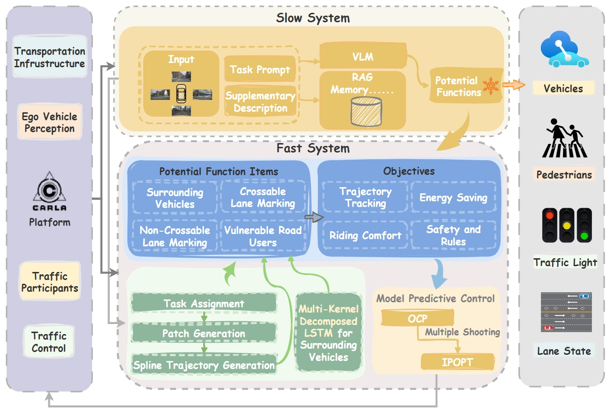
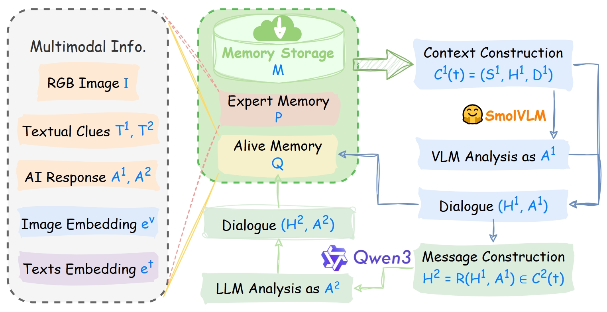
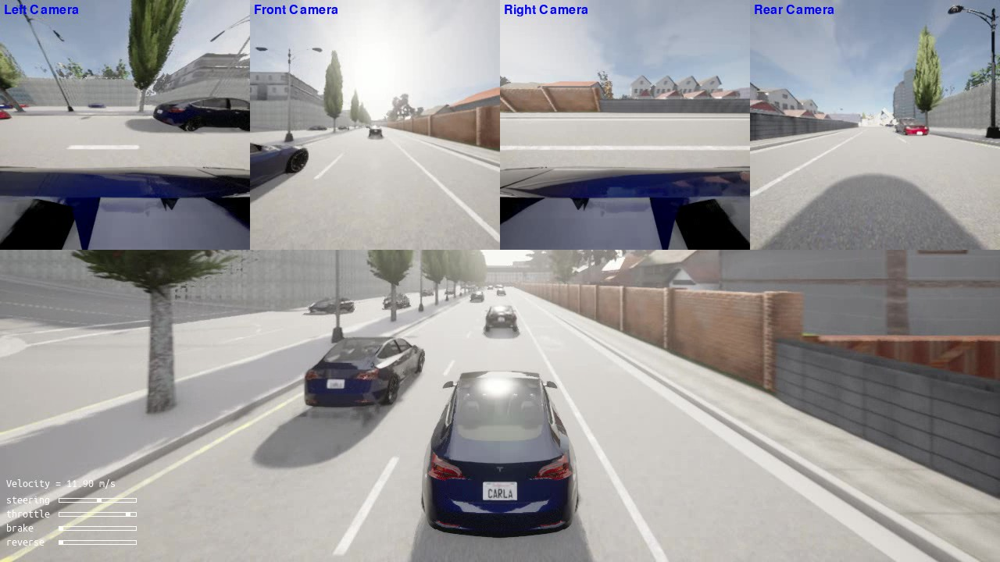

# VLM-UDMC: VLM-Enhanced Unified Decision-Making and Motion Control for Urban Autonomous Driving

[](https://arxiv.org/abs/2507.15266)
[](LICENSE)
[](https://carla.org/)
[](https://www.python.org/)

---

## 📄 Abstract

Scene understanding and risk-aware attentions are crucial for human drivers to make safe and effective driving decisions. To imitate this cognitive ability in urban autonomous driving while ensuring the transparency and interpretability, we propose a vision-language model (VLM)-enhanced unified decision-making and motion control framework, named **VLM-UDMC**. This framework incorporates scene reasoning and risk-aware insights into an upper-level slow system, which dynamically reconfigures the optimal motion planning for the downstream fast system. The reconfiguration is based on real-time environmental changes, which are encoded through context-aware potential functions.

More specifically, the upper-level slow system employs a two-step reasoning policy with Retrieval-Augmented Generation (RAG), leveraging foundation models to process multimodal inputs and retrieve contextual knowledge, thereby generating risk-aware insights. Meanwhile, a lightweight multi-kernel decomposed LSTM provides real-time trajectory predictions for heterogeneous traffic participants by extracting smoother trend representations for short-horizon trajectory prediction.

The effectiveness of the proposed VLM-UDMC framework is verified via both simulations and real-world experiments with a full-size autonomous vehicle. It is demonstrated that the presented VLM-UDMC effectively leverages scene understanding and attention decomposition for rational driving decisions, thus improving the overall urban driving performance.

> 🔗 **Preprint**: [https://arxiv.org/abs/2507.15266](https://arxiv.org/abs/2507.15266)  
> 💡 **Open Source**: This repository is part of our commitment to open science and reproducible research.

---

## 🖼️ Framework Overview

Below is the overall architecture of the **VLM-UDMC** framework:



*The VLM-UDMC framework integrates a slow semantic reasoning system (powered by VLMs and RAG) with a fast MPC-based motion control system. Risk-aware insights from the VLM dynamically reconfigure the objective function of the Optimal Control Problem (OCP) via potential fields.*

---

## 🧠 Multimodal Prompt Design

Our two-step reasoning strategy uses structured prompts to guide the VLM and LLM for robust and interpretable decision-making:



*Stage 1: A VLM analyzes multi-camera images and answers situational questions. Stage 2: An LLM synthesizes these answers into a structured driving command with risk zones, lane availability, and blocking conditions.*

---

## 🎥 Demonstration Video

Watch VLM-UDMC in action under urban driving conditions:

[](images/overtaking_behavior.mp4)

👉 [Click to play video](images/overtaking_behavior.mp4)

*Demonstration includes overtaking, lane keeping, and dynamic obstacle avoidance — all guided by VLM reasoning with risk-zone attentions for MPC.*

---

## 📁 Project Structure

This repository contains modular components for simulation, perception interface, reasoning, prediction, and control. Here's a brief overview:

```
vlmudmc/
│
├── foundation_models/    # VLM and LLM models (SmolVLM, Qwen-3, etc.)
├── mk_forecast/          # Multi-kernel decomposed LSTM for trajectory forecasting
├── official/             # Official CARLA scenarios and evaluation scripts
├── scripts/              # Scripts for running the VLM-UDMC framework
├── spawnPoints/          # CARLA spawn points for different scenarios
├── utils/                # Tools for camera handling, coordinate transforms, logging
├── images/               # Figures and demo videos (framework.png, prompt.png, mixedtraffic.mp4)
├── README.md             # You are here!
├── vlmudmc_main.py       # Main entry point for running the VLM-UDMC framework
└── requirements.txt      # Python dependencies
```

### Key Features:
- ✅ **Two-step VLM+LLM reasoning** with Retrieval-Augmented Generation (RAG)
- ✅ **Risk-zone based attention** for efficient OCP reconfiguration
- ✅ **Multi-kernel decomposed LSTM** for accurate, low-latency trajectory forecasting
- ✅ **Potential field integration** with MPC for interpretable, adaptive motion planning
- ✅ Compatible with **CARLA simulator** and real-world sensor setups
- ✅ Real-time capable design (< 0.3 ms prediction latency, ~1 Hz VLM inference)

---

## 🛠️ Getting Started

To run the code:

1. Clone the repository:
   ```bash
   git clone https://github.com/henryhcliu/vlmudmc.git
   cd vlmudmc
   ```

2. Install dependencies:
   ```bash
   conda create -n vlmudmc python=3.9
   conda activate vlmudmc
   pip install -r requirements.txt
   ```

3. Launch simulation (requires CARLA 0.9.15):
   ```bash
   cd [path_to_carla]/carla-0.9.15
   ./carlaUE4.sh
    ```

4. Run the VLM-UDMC framework:
   ```bash
   python vlmudmc_main.py
   ```

> ⚠️ **Note**: Running the full VLM pipeline requires locally deployed models such as `SmolVLM` or `Qwen-3`. See their respective documentation for setup instructions.

---

## 📚 Citation

If you find this work useful in your research, please cite:

```bibtex
@article{liu2025vlmudmc,
  title={VLM-UDMC: VLM-Enhanced Unified Decision-Making and Motion Control for Urban Autonomous Driving},
  author={Liu, Haichao and Guo, Haoren and Liu, Pei and Ma, Benshan and Zhang, Yuxiang and Ma, Jun and Lee, Tong Heng},
  journal={arXiv preprint arXiv:2507.15266},
  year={2025}
}
```

---

## 🤝 Contributing

We welcome contributions! Please feel free to open issues for bug reports, feature requests, or questions. Pull requests are appreciated for documentation improvements, testing enhancements, and new scenario integrations.

---

## 🔐 Disclaimer

This codebase is released for academic and research purposes only. The authors assume no responsibility for any misuse or damage arising from its use. The associated paper is currently under peer review; updates will be made upon publication.

---

🚀 *Empowering transparent, reasoning-driven autonomous driving with vision-language models.*